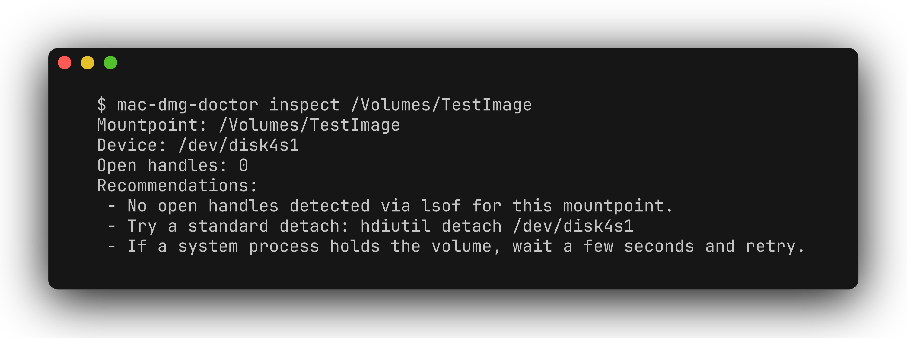

# mac-dmg-doctor

[](https://github.com/zhuhroscar-tech/mac-dmg-doctor/releases/tag/v0.1.0)

`mac-dmg-doctor` is a lightweight diagnostic helper for macOS users who see
"Resource busy" or similar errors when detaching/unmounting DMG or mounted
volumes.

It only *reads* system state and prints safe guidance; it does not forcefully
terminate processes or run destructive unmount operations.

## Simple explanation

If a Mac refuses to eject a disk image with a "Resource busy" error, this tool
tells you which app or process is still using it, instead of leaving you to
guess. Run it, read the plain-English report, then close the offending app and
try again. It never force-quits anything or unmounts a drive for you — it only
looks and reports.



```text
$ mac-dmg-doctor inspect /Volumes/TestImage
Mountpoint: /Volumes/TestImage
Device: /dev/disk4s1
Open handles: 0
Recommendations:
 - No open handles detected via lsof for this mountpoint.
 - Try a standard detach: hdiutil detach /dev/disk4s1
 - If a system process holds the volume, wait a few seconds and retry.
```

## Usage

```bash
# Scan mounted volumes with open handles
mac-dmg-doctor scan

# Inspect a specific mount point
mac-dmg-doctor inspect /Volumes/MyImage

# JSON output for scripting
mac-dmg-doctor scan --json
mac-dmg-doctor inspect /Volumes/MyImage --json
```

## Checks performed

- Reads `mount` output and highlights mount points under `/Volumes`.
- Uses `lsof +D <path>` to detect open file handles.
- Uses `hdiutil info` (if available) to correlate mounts to image paths.

## Security

No filesystem writes are performed.
